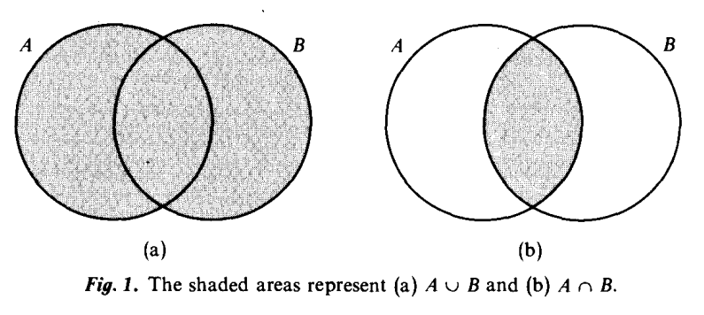

### ENDERTON - 1. Introduction

## Baby Set Theory (Teoria introdutória dos Conjuntos)

Enderton diz que neste capítulo introdutório ele abordará os aspectos mais elementares da teoria dos conjuntos, introduzindo alguns problemas, sem preocupação com uma abordagem rigorosa.

### Definição informal de conjunto

> A set is a collection of things (called its *members* or *elements*), the collection being regarded as a single object. We write "$t \in A$" to say that $t$ is a member of $A$, and we write "$t \not\in A$" to say that $t$ is not a member of $A$. (p.1)

Um conjunto é uma coleção de objetos (chamados *membros* ou *elementos*), a coleção é vista como um objeto único. Nós escrevemos $t \in A$  para afirmarmos que $t$ é um elemento de $A$ e escrevemos $t \not\in A$ para afirmarmos que $t$ não pertence a $A$. (tradução live)

### Igualdade entre Conjuntos

Enderton enuncia dois conjuntos:

- O conjunto $A$, que contém os quatro primeiros números primos: $A=\{2,3,5,7\}$.
- O conjunto $B$, que é o conjunto das soluições da seguinte equação polinomial: $x^4-17x^3+101x^2-247x+210=0$

O que se verifica é que $B=\{2,3,5,7\}$. Ou seja, contém extamente os mesmos elementos de $A$.

> $A$ and $B$ are the same set, i.e., $A=B$. It matters not that $A$ and $B$ were defined in different ways. Because they have exactly the same elements, they are equal; that is, they are one and the same set.

$A$ e $B$ são o mesmo conjunto, isto é, $A=B$. Não importa que $A$ e $B$ sejam definidos de modos diferentes. Eles são iguais porque contém exatamente os mesmos elementos, ou seja, eles são exatamente o mesmo conjunto.

**Princípio da Extensão**. Se dois conjuntos possuem exatamente os mesmos elementos, eles são iguais. De modo mais rigoroso, Enderton o define: Se $A$ e $B$ são conjuntos para os quais se para cada elemento $t$,

$$ t \in A \iff t \in B \implies A = B $$

> We write "$A = B$" to mean that $A$ and $B$ are the same object

Do contrário, escrevemos $A \neq B$ para dizermos que a condição $A = B$ não é verdadeira.

### Conjunto Vazio 

O conjunto vazio $\left( \emptyset \right)$ não possui elementos. Além disso, é o *único* conjunto sem elementos, já que o princípio da extensão garante que dois conjuntos iguais são coincidentes. A partir do conjunto vazio, por meio de várias operações da teoria dos conjuntos, uma grande variedade de conjuntos será contruída.

Por exemplo, nós podemos formar o conjunto $\left\{ \empty \right\}$ cujo único membro é $\empty$. Notemos que $\left\{ \empty \right\} \neq \empty$, basicamente porque $\empty \in \left\{ \empty \right\}$ mas $\empty \not\in \empty$.

***Não é o exemplo do Enderton.*** Podemos encarar o conjunto $\left\{ \empty \right\}$ como uma sacola vazia. Enquanto que o conjunto $\empty$ é o próprio vazio.

### União e Interseção <hr\>

A *união* dos conjuntos $A$ e $B$ é o conjunto $A \cup B$ de todos os elementos de $A$ ou $B$ - ou dos dois. A *interseção* dos conjuntos $A$ e $B$ é o conjunto $A \cap B$ dos elementos que pertencem simultaneamente a $A$ e a $B$.

$$
\left\{ x,y \right\} \cup \left\{ 4 \right\} = \left\{  x,y,4 \right\} \\
\left\{ 1,2,3,4 \right\} \cup \left\{ 2,3 \right\} = \left\{  2,3 \right\}
$$

Dois conjuntos $A$ e $B$ são ditos *disjuntos* se não possuem elementos em comum: $A \cap B = \empty$.

Um conjunto $A$ é dito *subconjunto* de um cojunto $B$(representado por $A \subseteq B$), se, e somente se, cada elemento de $A$ também é elemento de $B$.

<strong >1. Todo conjunto é subconjunto dele mesmo</strong>

<strong>2. O conjunto vazio é subconjunto de qualquer outro conjunto</strong>

$$\text{}$$

**Demonstração.** De fato, se assumirmos que o conjunto vazio não é subconjunto de um conjunto $A \text{ } (\empty \not\subseteq A)$. Então pela definição de subconjunto assumimos que $\exists \text{ } t \in \empty \colon t \not\in A$. Mas como o conjunto vazio não possui elementos, a sentença é uma contradição. Logo, prova-se que $\empty \subseteq A, \text{ } \forall A$.

**Demonstração por vacuidade**. Por definição $X \subseteq A$ significa:

$$\forall \text{ } x, x \in X \rightarrow x \in A$$

Mas, em nosso caso $X = \empty$ e, portanto, a hipótese $x \in X$ é falsa, já que o conjunto vazio não possui elementos. Logo, sendo falsa a hipótese, a conclusão é verdadeira, então $\empty \in A$, independente do conjunto $A$.

$$
\square \\
$$

Se $A \subseteq B$ também podemos dizer que $A$ está contido em $B$ ou que $B$ contém $A$. Esta relação de inclusão ($\subseteq$)  não pode ser confundida com a relação de pertinência ($\in$).  A relação $A \in B$ só é possível se o conjunto $A$ for um *elemento* do conjunto $B$, por inteiro.

Imaginemos que $A$ seja uma bolsa contendo objetos. Digamos que $A$ contenha relógio, carteira e caneta. Se o conjutno $B$ for uma mochila. A relaçao $A \in B$ acontecerá sob a condição da "bolsa" $A$ estar inteira, com seus elementos, dentro da "mochila" $B$. Na relação de inclusão, por outro lado, em nossa analogia, faríamos a comparação entre os objetos contidos na "bolsa" $A$ e na "mochila" $B$.

**Exemplo:**

1. $\empty \subseteq \empty$ mas $\empty \not\in \empty$
2. $\left\{\empty\right\} \in \left\{\left\{\empty \right\}\right\}$ mas $\left\{\empty\right\} \not\subseteq \left\{\left\{\empty \right\}\right\}$. Perceba que $\empty$ não é um elemento de $\left\{\left\{\empty \right\}\right\}$

$\text{ }$

### Conjunto das Partes (Conjunto Potência)

Qualquer conjunto $A$ terá um ou mais subconjuntos. Nós podemos agrupar esses subconjuntos em um conjunto chamado*Conjunto das Partes de $A$*, que representamos por $\mathcal{P}(A)$. Vejamos alguns exemplos:

$$
\begin{aligned}
& A = \empty \implies \mathcal{P}(A) = \left\{  \empty \right\} \\
& A = \left\{ \empty \right\} \implies \mathcal{P}(A) = \left\{  \empty, \left\{  \empty \right\} \right\} \\
& A= \{a,b\} \implies \mathcal{P}(A) = \left\{ \empty, \{ a \}, \{b\}, \{a,b\} \right\}
\end{aligned}
$$

### Definindo um Conjunto

Enderton chama atenlção para um modo muito versátil de definir conjuntos: a *abstração*. Esse modo de definir conjuntos especifica uma certa condição que um elemento deve obedecer para fazer parte de um conjunto.

**Exemplo.** $\mathcal{P}(A)$ é o conjunto de todos os elementos $x$ tal que $x$ é um subconjunto de $A$. Então, podemos declarar:

$$
\begin{aligned}
& \mathcal{P}(A) = \left\{ x \text{ }| \text{ }x \text{ é subconjunto de }  A \right\} \\
& \mathcal{P}(A) = \left\{ x \text{ }| \text{ }x \subseteq  A \right\}
\end{aligned}
$$

**Exemplo.** $A \cap B$ é o conjunto dos elementos $y$, tais que $y \in A$ e $y \in B$. Podemos representar como:

$$
A \cap B = \left\{ y \text{ } | \text{ } y \in A \text{ e } y \in B \right\}
$$

**Exemplo.** O conjunto $D= \left\{ z \text{ } | \text{ } z \neq z\right\}$ é o conjunto vazio ($\empty$), pois não existe algum $z$ que satisfaça a condição

### Paradoxos Interessantes

***Paradoxo de Berry.*** A formulação desse paradoxo pode ser a seguinte:

$$
\left\{ x \text{ }| \text{ } x \text{ é o menor inteiro positivo que não pode ser descrito em menos de treze palavras} \right\}
$$

No entanto a frase tem $12$ palavras e aí reside o paradoxo: se o número existe, então ele pode ser descrito em $12$ palavras, o que contradiz a definição. Se o número não existe, então **todo** inteiro pode ser descrito em menos de $13$ palavras (o que há absurdo pois há um número infinito de inteiros e um número finito de frases de 12 palavras).

Esse paradoxo demonstra o limite da abstração que é a definição de um objeto utilizando uma propriedade que depende da linguagem de definição. Isso pode implicar em uma circularidade, pois a descrição se inclui no conjunto de descrições que ela se propõe a delimitar.

***Paradoxo de Russell*.** Consideremos a seguinte definição:

$$\left\{ x \text{ } | \text{ } x \not\in x  \right\}$$

Ela representa o conjunto de todos os elementos que não pertencem a ele próprio. Se chamamos a esse conjunto de $A$ e perguntarmos *$A$ é um elemento de si mesmo?* Se $A \not\in A$, então $A$ atende às condições de $A$ e, portanto $A \in A$. Por outro lado, se $A \in A$ então ele não atende às condições e $A \not\in A$. É impossível que ambas as condições sejam verdadeiras ao mesmo tempo.

Esses dois paradoxos receberão soluções, a partir do sistem axiomático, a serem discutidas mais adiante.
